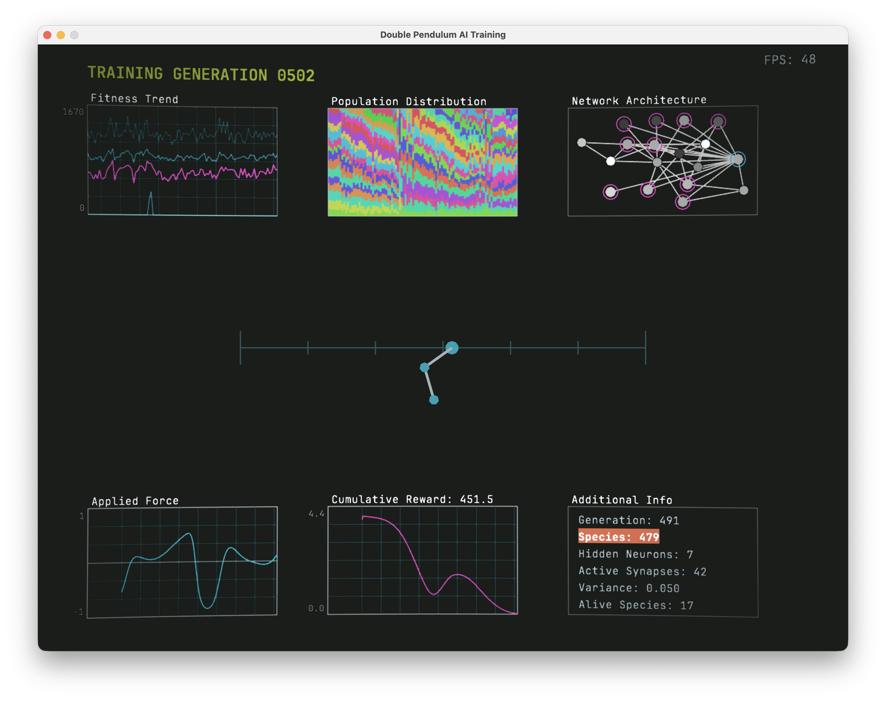
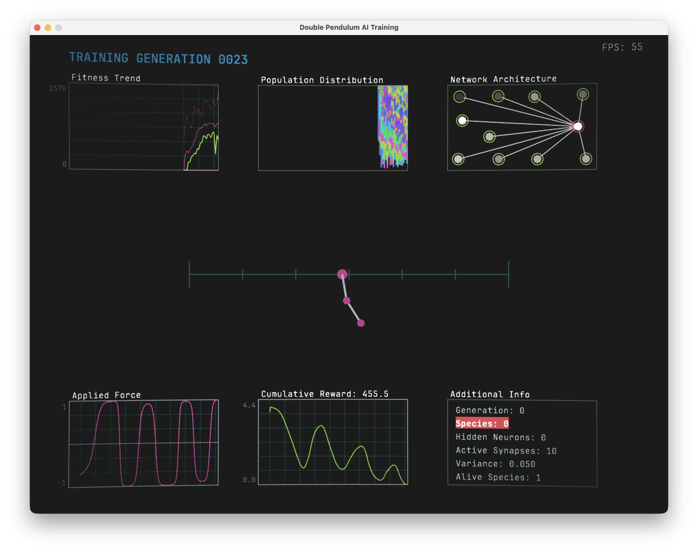

## define `neat`
1. *adjective*
orderly and clean; tidy

2. *initialism*
Neuroevolution of Augmenting Topologies
3. *noun* a genetic algorithm for generating evolving artificial neural networks which alters both the weights and biases of individual nodes as well as the overall structure of the network

# neatAgent
### About
This project implements a version of the NEAT genetic algorithm in Python to develop an agent that can eventually balance a double pendulum. It uses `numba` just-in-time compilation to optimize the physics and training cycle, and `arcade` to visualize the agent's progress and analyze generation data.

### Technical Specifications
The simulation relies on a custom-built physics engine and a specific state-space interpretation for the neural network. 

**Integration Method**
To maintain stability over long simulation periods without exorbitant computational overhead, the physics engine utilizes **semi-implicit Euler integration**.

**State Space (Observations)**
To avoid discontinuity issues when angles wrap around 360 degrees, the agent is not fed raw angles. Instead, it observes a 10-dimensional vector containing positional data, velocities, and trigonometric components per frame:
s = [x_cart, v_cart, sin(theta), cos(theta), v_x, v_y, sin(phi), cos(phi), w_x, w_y]

**Fitness Function**
The agent is evaluated on its ability to maximize the height of the pendulum while minimizing chaotic, erratic movements. 
* **Primary Reward:** Exponentially rewards height: R_base = h_norm^2
* **Centering Penalty:** Softly pulls the cart toward the center of the track to prevent riding the boundaries: -0.1 * |x_cart| - 0.05 * |v_cart|
* **Smoothness Penalty:** Punishes sudden, jerky changes in applied force to encourage stable control policies: -0.5 * (delta_F)^2

### Configuration & Parameters
The environment and evolutionary algorithm are governed by the following constants:

| Training Parameters | Value | Physics Parameters | Value |
| :--- | :--- | :--- | :--- |
| **Population** | 256 agents | **Time Step (dt)** | 1/60 sec |
| **Sim Time** | 20s per evaluation | **Gravity** | 9.81 m/s^2 |
| **Elite Percentile** | 10% advance untouched | **Max Force** | 8 N |
| **Elite Mutate** | 80% (remaining 20% common) | **Friction Multiplier** | 1.0 |
| **Compatibility Threshold** | 15.0 (Speciation variance)| **Track Length** | 6 m |
| **Curriculum Step** | 0.005 | **Screen Bounds** | 14m x 16m |
| **Next Stage Cutoff** | 400 upright frames (90th %ile) | **Render Scale** | 100 pixels/meter |

### Usage & Checkpoints
When `gui.py` is executed, the simulation will continuously run and train the population. The program automatically creates a `saved_networks/` directory in the root folder. The top-performing network of every 10th generation—along with other notable standout agents—is automatically serialized and saved here for future review or deployment.

### Performance
This project utilizes multiprocessing to scale performance directly to the number of available CPU cores. With the default settings (256 agents, 20-second simulation time, 60Hz physics step), a MacBook Air M3 can process approximately 200 generations in 45 seconds. *(Note: Because `numba` requires initial JIT compilation, the very first generation will experience a slight delay before accelerating).*

### Screenshots

|  |  |
|----------------------------------------------------------|----------------------------------------------------------|

### Current Challenges
As of now, the agent rarely reaches a state where the double pendulum achieves a sustained, stable balance—even after thousands of training generations. The fitness landscape may be too sparse, the smoothness penalty might be too restrictive early in the curriculum, or the integration steps may introduce micro-instabilities that compound over time. Investigating the exact cause is an ongoing area of research for this repository.

### Building
To run this project locally, you will need Python installed (3.13 is recommended). It is highly advised to run this project inside a virtual environment to prevent dependency conflicts with global packages.

1. **Clone the repository and navigate into it:**

        git clone https://github.com/horse-5-333/neatagent.git
        cd neatAgent

2. **Create a virtual environment:**

        python3 -m venv .venv

3. **Activate the virtual environment:**

        source .venv/bin/activate

4. **Install the required dependencies:**
   Ensure your terminal prompt shows `(.venv)` before running this command.

        pip install -r requirements.txt

5. **Run the simulation:**

        python gui.py